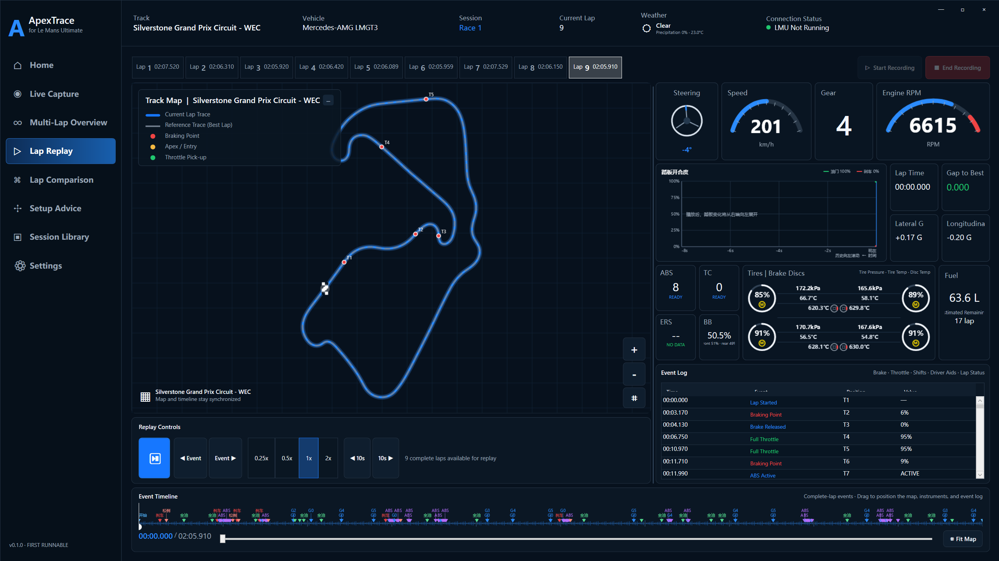
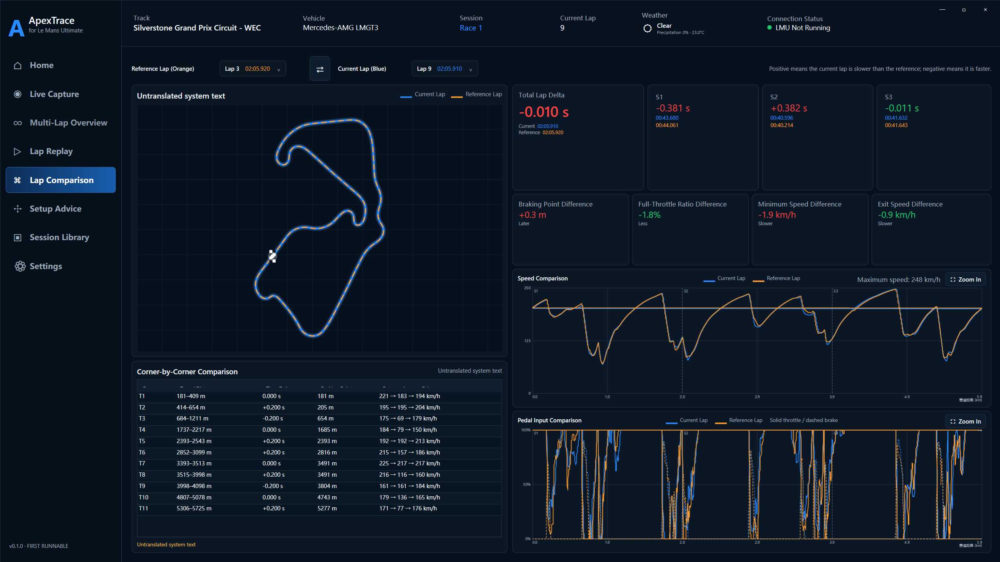
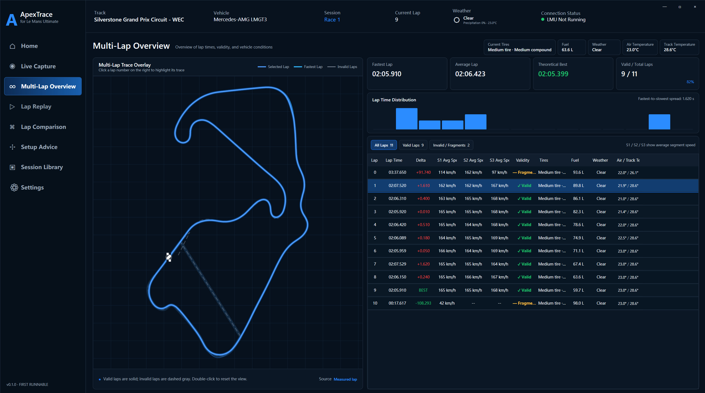
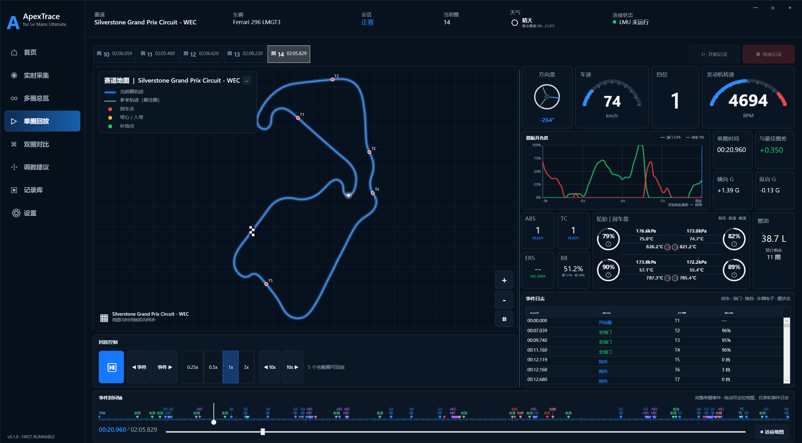

# ApexTrace

**Open-source telemetry, lap analysis, and evidence-based setup guidance for Le Mans Ultimate.**

[](https://github.com/luoluoduo218-png/ApexTrace/releases/latest)
[](LICENSE)
[](https://github.com/luoluoduo218-png/ApexTrace/releases/latest)
[](https://dotnet.microsoft.com/)

ApexTrace is a native Windows desktop companion for **Le Mans Ultimate (LMU)**. It turns official, read-only game telemetry into live instruments, reconstructed racing lines, multi-lap analysis, synchronized replay, lap comparison, automatic corner detection, and cautious setup experiments backed by recorded evidence.

> **Project status:** v0.1.0 is the first public runnable release. It is useful today, but should still be treated as early software. Please report reproducible issues through GitHub Issues.



## Download and run

1. Open the [latest GitHub Release](https://github.com/luoluoduo218-png/ApexTrace/releases/latest).
2. Download `ApexTrace-v0.1.0-win-x64.zip`.
3. Extract the ZIP to any writable folder.
4. Run `ApexTrace.App.exe`.
5. Open **Settings** and select your Le Mans Ultimate installation if it is not detected automatically.

The release is self-contained for Windows x64; users do **not** need to install the .NET runtime. ApexTrace is currently distributed as an unsigned portable application, so Windows SmartScreen may ask for confirmation on first launch.

For live capture, start LMU, enable the official Plugins option in the game's Gameplay settings, enter a drivable session, and then select **Start Recording** in ApexTrace. When LMU is not running, ApexTrace can import the latest non-empty native telemetry DuckDB from `UserData\Telemetry` without modifying it.

## What ApexTrace provides

- **Read-only live capture** from the official `LMU_Data` shared-memory interface.
- **Offline import** from LMU's native telemetry DuckDB files.
- **Live dashboard** with speed, RPM, gear, steering, pedals, driver aids, fuel, tire and brake status, weather, and track position.
- **Multi-lap overview** with validity, lap-time distribution, theoretical best, conditions, and racing-line overlays.
- **Synchronized lap replay** with a track map, instruments, event log, event timeline, and variable playback speed.
- **Lap comparison** with total and sector deltas, braking, throttle, minimum-speed, exit-speed, and corner-by-corner evidence.
- **Automatic corner analysis** derived from steering, speed, and braking signals.
- **Evidence-based setup guidance** designed around controlled, one-variable A/B tests; ApexTrace never writes setup values back to the game.
- **Crash-safe recording recovery** from local NDJSON checkpoints.
- **Portable `.apextrace` sessions** containing structured metadata, JSON, CSV, Parquet, SVG, and PNG outputs.
- **Built-in localization architecture** with Chinese, English, and German language selections plus external language-pack support.

## Product tour

### Lap replay

Replay a complete lap while the map, vehicle instruments, event log, and timeline stay synchronized.


### Lap comparison

Overlay two laps and inspect where time was gained or lost through sector summaries, speed traces, pedal traces, braking points, and corner-level metrics.



### Multi-lap overview

Review consistency, valid and fragmented laps, environmental conditions, theoretical best performance, and the shape of every measured lap.



### Localization

The same telemetry workspace can be presented through built-in language packs. The screenshot below shows the Chinese interface.



## Safety and data boundaries

ApexTrace is intentionally read-only around LMU:

- It uses the official LMU headers, the official `LMU_Data` shared-memory interface, and legally readable telemetry or metadata.
- Shared memory is opened with `MemoryMappedFileRights.Read`.
- It does not inject into the game, hook the process, write game memory, or use legacy rFactor 2 shared-memory DLLs.
- It does not open or decrypt protected MAS archives.
- When official track geometry is unavailable, it reconstructs a track trace from measured telemetry and labels incomplete evidence conservatively.
- It does not fabricate complete laps or setup advice when the recorded evidence is insufficient.

## Data locations

- Saved sessions: `%LOCALAPPDATA%\ApexTrace\Sessions`
- Recovery checkpoints: `%LOCALAPPDATA%\ApexTrace\Temp`
- Manual exports: `%USERPROFILE%\Documents\ApexTrace\Exports`
- Logs and preferences: `%LOCALAPPDATA%\ApexTrace`

## Build from source

Requirements: Windows x64 and PowerShell. The bootstrap script downloads the pinned .NET 10 SDK into the repository when needed.

```powershell
git clone https://github.com/luoluoduo218-png/ApexTrace.git
cd ApexTrace
.\scripts\build.ps1
.\scripts\test.ps1
.\scripts\run.ps1
```

Create the portable release package with:

```powershell
.\scripts\publish.ps1
```

The runnable directory and ZIP archive are written to `artifacts`.

## Known limitations

- Automatic corner boundaries are inferred from telemetry and are not yet mapped to official corner names or numbers.
- Complete garage setup coverage depends on official metadata that may not be available through `LMU_Data`.
- Long-duration endurance, clean-machine installation, and the full 100%/125%/150% DPI matrix still need broader community validation.
- The current portable build is unsigned and has no installer or automatic updater.

See [verification evidence](docs/VERIFICATION.md), the [language-pack guide](docs/LANGUAGE_PACKS.md), and the [product specification](docs/product-spec/README_FIRST.md) for implementation detail.

## Contributing

Bug reports, telemetry edge cases, localization improvements, documentation, tests, and focused pull requests are welcome. Please avoid attaching copyrighted game assets, protected archives, private session data, or credentials to public issues.

## License and trademark notice

ApexTrace is released under the [MIT License](LICENSE). Third-party notices are listed in [THIRD_PARTY_NOTICES.md](THIRD_PARTY_NOTICES.md).

ApexTrace is an independent community project. It is not affiliated with, endorsed by, or sponsored by Studio 397, Motorsport Games, the FIA World Endurance Championship, or Le Mans Ultimate. All product names and trademarks belong to their respective owners.
